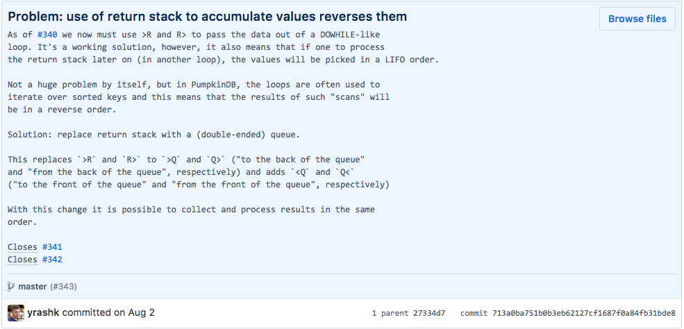

# Solving Problems, One Commit at a Time

If you have been following some of my projects in the past year or so, you
might have noticed that the my commit messages changed considerably and they no
longer look typical. Take a look at this one:

<!-- more -->



??? quote "Screenshot transcription"

    ```markdown
    Problem: use of return stack to accumulate values reverses them
    As of #340 we now must use >R and R> to pass the data out of a DOWHILE-like
    loop. It's a working solution, however, it also means that if one to process
    the return stack later on (in another loop), the values will be picked in a LIFO order.
    
    Not a huge problem by itself, but in PumpkinDB, the loops are often used to
    iterate over sorted keys and this means that the results of such "scans" will
    be in a reverse order.
    
    Solution: replace return stack with a (double-ended) queue.
    
    This replaces `>R` and `R>` to `>Q` and `Q>` ("to the back of the queue"
    and "from the back of the queue", respectively) and adds `<Q` and `Q<`
    ("to the front of the queue" and "from the front of the queue", respectively)
    
    With this change it is possible to collect and process results in the same
    order.
    
    Closes #341
    Closes #342
    ```

I shamelessly copied this commit message format from [Pieter Hintjens](http://hintjens.com/)’ [__C4__](https://rfc.zeromq.org/spec/42/)
unprotocol. At first, this kind of commit message felt weird. Why would we want
to begin every commit with a word “__Problem__”? What’s in it for me?

Turns out, there are multiple benefits to sticking to this ceremony.

__Firstly__, it gives you, the author of the change, an opportunity to understand
what you are actually working on. Often times, if I am not quite sure what am I
trying to accomplish, I’d prepare a WIP commit or a GitHub issue that simply
and unambigously states the problem.

As opposed to purely self-documenting commit messages (say, “Added a reference
to a user ID”) we’re documenting the reason why we bothered to torture
the keyboard in the first place.

As a consequence, this kind of scoping prevents us from having to figure out
the level of granularity of commit messages. A friend of mine recently
complained to me that his new hire is pushing tons of very small commits and
that was bothering him. As annoying as that may be, this case illuminates the
underlying problem: where do we draw the line in the sand if our changes are,
say, touching different parts of the system?

With this approach, we can draw that line at solving one and only one problem
at a time.

__Secondly__, it gives you a context to every past change. Lets be frank, how easy
is it for you to remember why you, let alone another person, did this or that
change, three months later? A year? Ten?

By recording the entire context, we are giving everybody who’ll be working with
the codebase (contributors, users, etc.) a way to figure out why changes
happened in the first place. In some cases it would relieve frustration, in
other, it’ll help figuring out which problems aren’t problems anymore and
therefore, what kind of improvements can be made.

Thirdly, it’s a great way to understand incoming changes. If you maintained a
collaboratively developed project before, how many times have you received a
pull request that left you wondering “why on Earth?..”

By focusing on (and explicitly stating) the problem this change is solving, you
can help the maintainers understand your perspective and (surprise, surprise!)
make it easier for your change to be successfully merged.

Which leads me to another point. Not being able to understand each other is
often the reason why people can be less than excellent to each other. This
being a big issue in the community these days, working on contributing to a
pool of shared meaning will be a net benefit.

I’ve heard some concerns about using this format, mostly boiling down to _“my
team mates aren’t producing insanely great commit messages right now, how can I
expect them to adhere to a much more demanding format?”_

On the surface, this makes sense. However, the beauty is in rigidity of this
format. It gives you simple rules, a framework for making statements of a very
specific kind. Once most of common mistakes are learned, this becomes a second
nature. As far as I can tell, the most common issue is writing messages like
“Problem: no author_id” / “Solution: add author_id”. Obviously, this is a
problem expressed through the solution, so an extra step has to be made to
understand why there is this change.

Try it out on an open source or a side-project!

__Bonus tip__: when starting a new project, make an empty first commit with the
Problem/Solution statement in its message. This will help others understand WHY
this project has been started and WHAT does it do.

