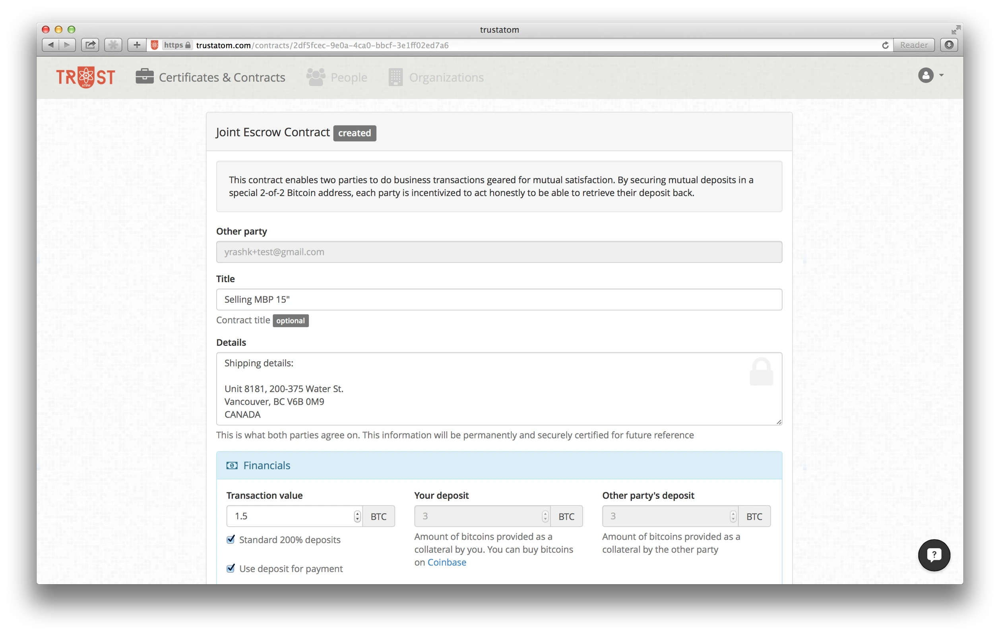

# Past Startups

## Trustatom (2014-2015) { #trustatom }

After deparing Trustatom I travelled to Asia to reset. While in Japan, I came up with the idea of
a small service that would do a limited set of _smart contracts_ based on Bitcoin. 

=== "Main page"

    

=== "Join Escrows"

    

=== "IP Cerificate"

    

With limited success selling this, I've raised some money and pivoted to a more specific niche of
fundraising and created a small product called Streamline.vc. The product was used to routinely register
information (such as ownership structure, KPIs and other documents) by startups to prove to their investors
that those weren't essentially _made up last night_, providing better assurance of the accuracy of this information.

!!! tip "Domain was gone and is now listed on [HugeDomains](https://www.hugedomains.com/domain_profile.cfm?d=trustatom.com) for $2,795"

!!! tip "[streamline.vc](streamline.vc) was also let go and is now on sale on [Dan.com](https://dan.com/buy-domain/streamline.vc) for $7,495"

## Bex.io (2013-2014) { #bex-io }

Bex.io was a spin off from Spawngrid's consultancy. In 2013, with all that
early hype around Bitcoin, there was a great interest in running exchanges. Some clients
approached us to see if they can hire us to build one. 

Instead, we offered to build Bitcoin exchange as a service (turnkey solution) where clients
were to provide local compliance and marketing. 

We've secured some prospective clients and initial seed funding. Unfortunately, we had our fair
share of issues both in leadership and delivery so it was wound down around 2015.

!!! tip "Somebody is now trying to [sell bex.io domain](https://ca.godaddy.com/domainsearch/find?checkAvail=1&tmskey=&domainToCheck=bex.io&isc=cjc99com&cjelbDays=45&AID=10450071&SID=domainr.com&utm_source=cj&utm_medium=affiliate&utm_campaign=xx-xx_corp_affiliate_10450071_001&utm_content=nb.io%2c+LLC_2513766&tgt=3198382&cjdata=MXxOfDB8WXww) for $100K"

## Spawngrid (2011-2013) { #spawngrid }

Spawngrid started around 2011 as an attempt to build a cloud for deploying
complex Erlang-based systems. Over time, overwhelmed with the sheer
complexitity of the problem, Spawngrid experimented with some other products
like Test.io (_automatic test generation product_, for which it received
some [NRC IRAP](https://nrc.canada.ca/en/support-technology-innovation) funding). 
Failing to secure clients for this, it became a consultancy company.

!!! tip "Domain was gone and is now listed on [HugeDomains](https://www.hugedomains.com/domain_profile.cfm?d=spawngrid.com) for $2,195"

## Issues Done (2007-2008) { #issuesdone }

An early startup trying to build a web-based [Getting Things Done](https://en.wikipedia.org/wiki/Getting_Things_Done) application.
Had some fun ideas but wasn't able to market it.

!!! tip "The domain is still owned by a friend of mine who was a partner in this venture"
